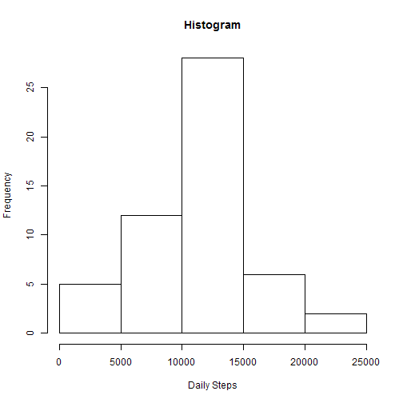
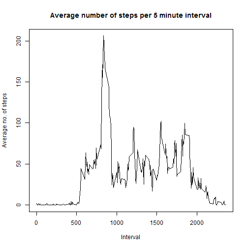
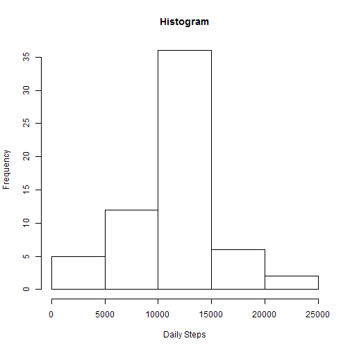
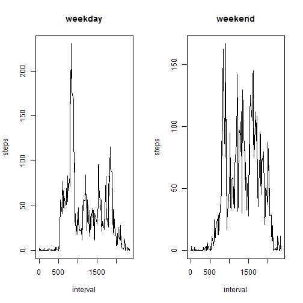

# Reproducible Research: Peer Assessment 1


## Loading and preprocessing the data

```r
setwd("C:/Users/Jangedoo/Documents/GitHub/RepData_PeerAssessment1")
data = read.csv(file = "activity.csv")
```


## What is mean total number of steps taken per day?
To compute this we will use sqldf library. It allows us to execute SQL queries in dataframe.

```r
library(sqldf)
query = "select date, sum(steps) as dailySteps from data group by date"
transformed = sqldf(query)
transformed$dailySteps = as.numeric(transformed$dailySteps)
hist(x = transformed$dailySteps, xlab = "Daily Steps", main = "Histogram")
```

 

```r

print(mean(transformed$dailySteps, na.rm = TRUE))
```

```
## [1] 10766
```

```r
print(median(transformed$dailySteps, na.rm = TRUE))
```

```
## [1] 10765
```


## What is the average daily activity pattern?
To compute this, we just group-by the data on interval

```r
pattern = sqldf("select interval, avg(steps) avgSteps from data group by interval")
plot(pattern, type = "l", xlab = "Interval", ylab = "Average no. of steps", 
    main = "Average number of steps per 5 minute interval")
```

 


The 5-minute interval with max. number of steps (on average). For this we just find out the interval with max number of avg. steps

```r
pattern[pattern$avgSteps == max(pattern$avgSteps), "interval"]
```

```
## [1] 835
```


## Imputing missing values

Total Number of missing values in dataset.

```r
sum(!complete.cases(data))
```

```
## [1] 2304
```


To fill the missing values, we replace by the average for that 5-minute interval

```r
imputedData <- data
for (i in 1:nrow(imputedData)) {
    if (is.na(imputedData[i, "steps"])) {
        imputedData[i, "steps"] <- subset(pattern, interval == imputedData[i, 
            "interval"])$avgSteps[1]
    }
}
```


Histogram plot of imputed data

```r
query <- "select date, sum(steps) as dailySteps from imputedData group by date"
transformed <- sqldf(query)
transformed$dailySteps <- as.numeric(transformed$dailySteps)
hist(x = transformed$dailySteps, xlab = "Daily Steps", main = "Histogram")
```

 

```r

print(mean(transformed$dailySteps, na.rm = TRUE))
```

```
## [1] 10766
```

```r
print(median(transformed$dailySteps, na.rm = TRUE))
```

```
## [1] 10766
```

## Are there differences in activity patterns between weekdays and weekends?

```r
weekend <- weekdays(as.Date(imputedData$date)) %in% c("Saturday", "Sunday")
imputedData$dayType <- "weekday"
imputedData$dayType[weekend == TRUE] <- "weekend"
imputedData$dayType <- as.factor(imputedData$dayType)

weekdays <- subset(imputedData, dayType == "weekday")
weekends <- subset(imputedData, dayType == "weekend")

weekdays <- sqldf("select interval, avg(steps) as avgSteps from weekdays group by interval")
weekends <- sqldf("select interval, avg(steps) as avgSteps from weekends group by interval")

par(mfrow = c(1, 2))
plot(weekdays$interval, weekdays$avgSteps, type = "l", main = "weekday", xlab = "interval", 
    ylab = "steps")
plot(weekends$interval, weekends$avgSteps, type = "l", main = "weekend", xlab = "interval", 
    ylab = "steps")
```

 

